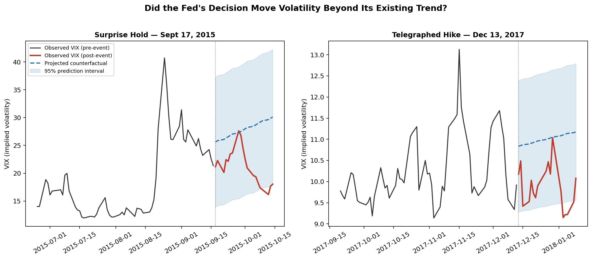

# Did It Actually Change, or Was It Already Trending That Way?

*An interrupted time series look at market volatility around Federal Reserve decisions*

When something changes after an event, it's tempting to assume the event caused the change. But what if the outcome was already moving in that direction?

A product launches and engagement rises. A policy changes and an outcome shifts. A treatment begins and symptoms improve. In each case, the same question is the same: **Did the event actually change the trajectory, or did the outcome simply continue along the path it was already on?**

I explored this question using Federal Reserve interest rate decisions and stock market volatility. Markets often have a good idea of what the Fed is going to do before a rate decision officially happens. However, the Fed occasionally makes surprising decisions. That creates a useful comparison. I looked at two decisions: one that surprised markets and one that was expected.

## The Method

For each decision, I looked at the 60 trading days leading up to the event. I used that period to estimate where volatility would have been heading if the existing pattern had simply continued. That gives us a counterfactual (an estimate of what might have happened without the event).

I then compared that expected trajectory with what actually happened after the Fed's decision. If the two paths stay close, there is little evidence that the event changed the trajectory. If they diverge, the event may have produced a change beyond what the existing trend would have predicted.

## Findings

**September 2015: Surprise hold**

The model projected that after a brief spike in the days before the Fed’s decision, volatility would continue rising in line with the overall trend. Instead, actual volatility fell substantially below the projected path after the Fed unexpectedly decided to hold rates steady.

**December 2017: Expected rate hike**

This decision was widely anticipated, and volatility was relatively calm going into the meeting. Afterward, actual volatility stayed close to the projected path, with only a small divergence.

The surprise decision produced a much larger departure from the trajectory than the expected decision did. In other words, the market's reaction appears to have depended not just on what the Fed did, but on how much the decision differed from what markets expected.

## The Nuances

Since counterfactual is not something we can observe, we have to estimate it. And that estimate is only as good as the assumptions behind it.

In the September 2015 example, the model projected volatility along a roughly upward trajectory. But that trajectory depends on assumptions about whether the relationships used to construct the projection are stable over time, whether the metrics used to represent those relationships are appropriate, and whether other factors were influencing volatility.

A model’s credibility also becomes particularly important when the variables we are trying to understand are difficult to observe directly. Human behavior, for example, is influenced by many factors that are not directly visible in the data. When those underlying drivers are hidden, there is more room for our models to capture an incomplete picture of what is actually happening.

One way to address this is to be more rigorous about the assumptions behind both our measures and our models. For example, latent variable models can help when the concept we want to measure, such as an underlying behavioral tendency, cannot be directly observed. Time-series approaches can also help us examine how outcomes change over time rather than assuming that relationships remain static.

## Why This Matters Beyond Financial Markets

This same approach, using a prediction to stand in for an alternative path we didn’t get to observe, underlies techniques in fields from economics to clinical trials, where digital twins increasingly substitute for a placebo group. The method is helpful for investigating causality, but the answers are only as accurate as the design of the model.

The markets were surprised when their expectations differed from reality. We have the opportunity to question our statistical assumptions before being surprised.

*Data: CBOE Volatility Index (VIX), Federal Reserve Bank of St. Louis (FRED).*
*Event dates: Federal Reserve Board, FOMC historical meeting records.*
